# PizzaHub - A website for ordering pizza that was built using ReactJs and NextJs

## Live link - https://pizza-hub-two.vercel.app/

## Main features

- Prouduct list page with quickview
- product details page 
- Cart for adding items
- Checkcout (with proper form validation)
- Order details page
- My orders page (list of my previous orders)

## Screenshots

  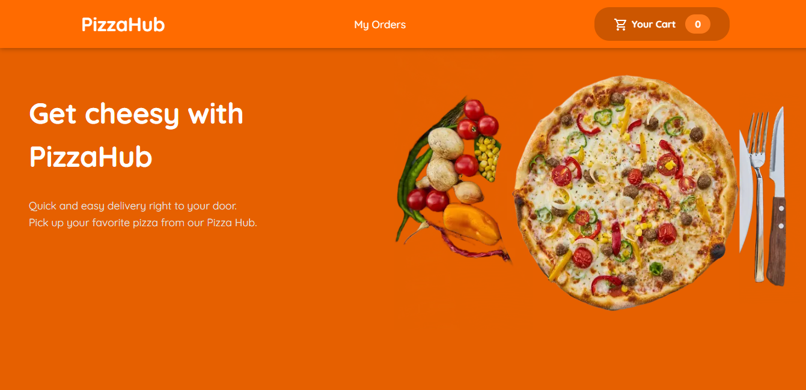
  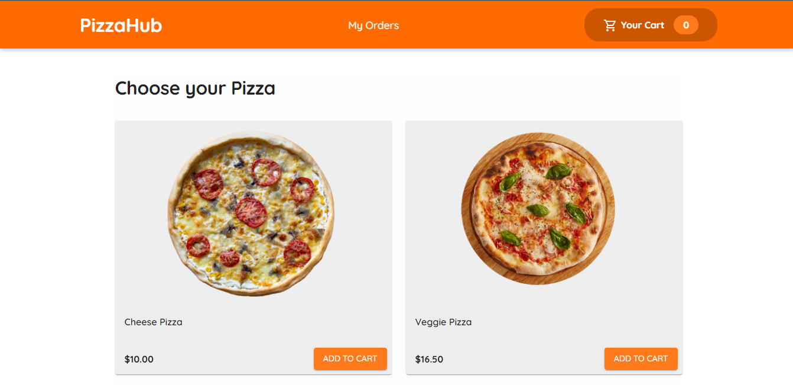
  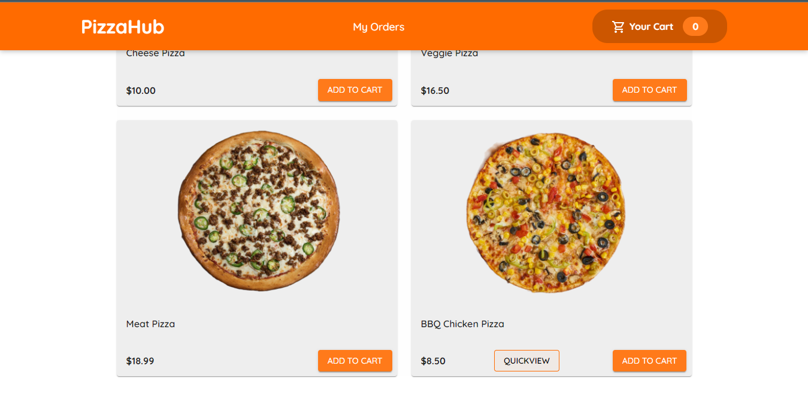

  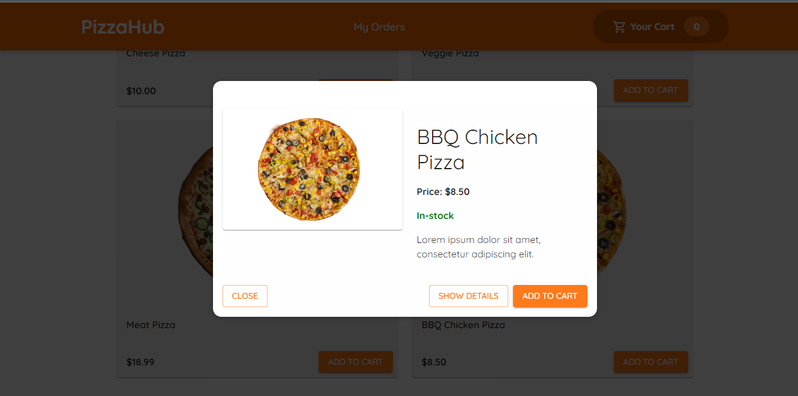
  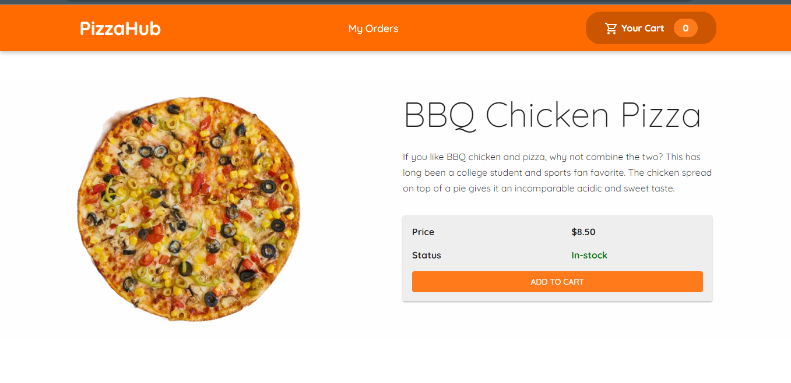
  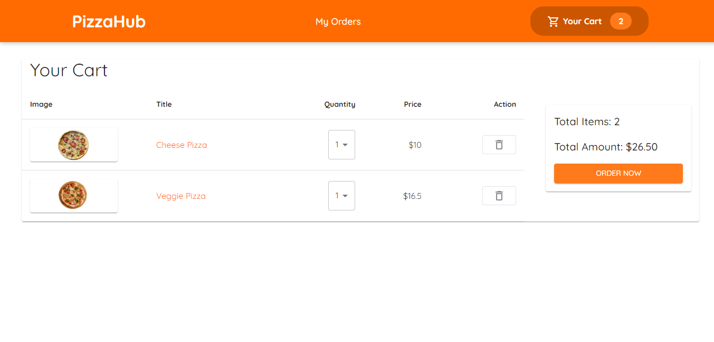

  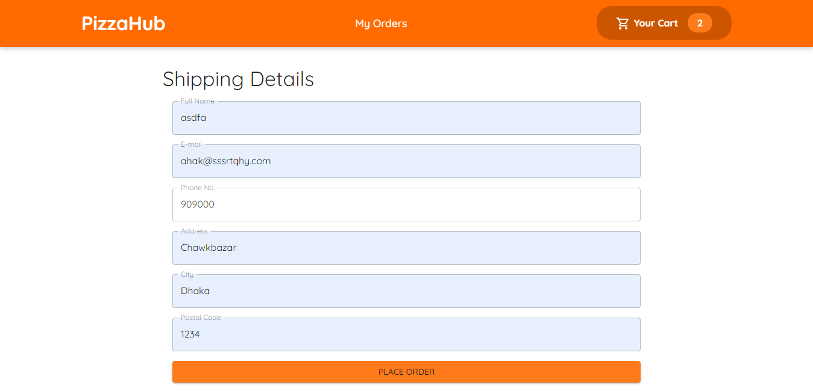
  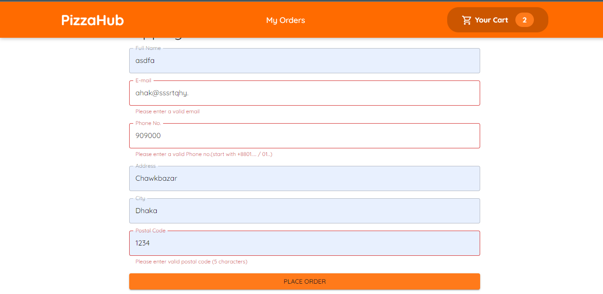
  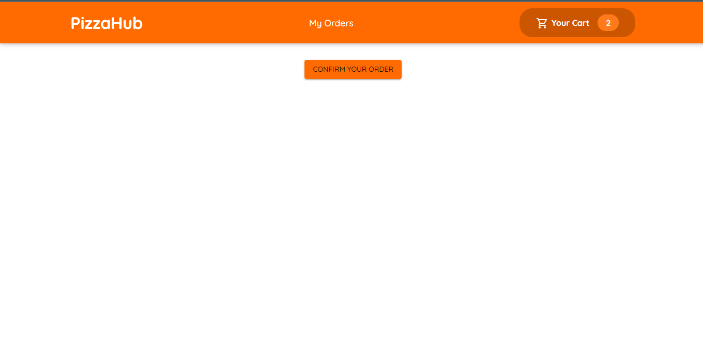

  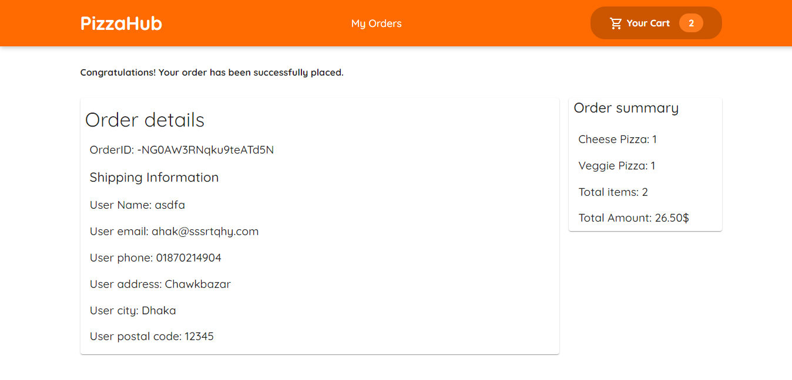
  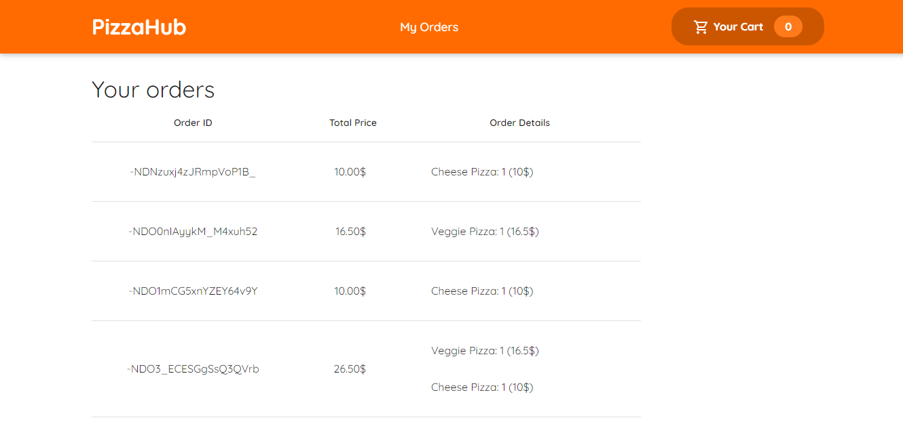

